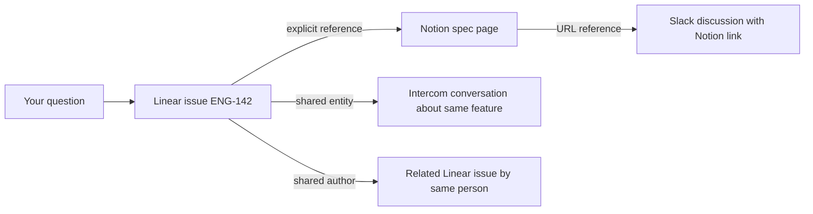

Ravell doesn't just search your tools — it builds a knowledge graph that connects documents across Linear, Notion, Intercom, Slack, and Attio. This page explains how that works under the hood, including how Ravell automatically extracts product problems and ranks them by evidence.

---

## How documents are linked

When Ravell indexes a document, it creates links to related documents. These links are what make cross-tool answers possible.

| Link type | How it works | Example |
|-----------|--------------|---------|
| **Explicit reference** | A document mentions an identifier (e.g. ENG-142); Ravell links to the indexed document with that identifier | A Notion page that mentions "see ENG-142" links to that Linear issue |
| **Shared entity** | Two documents mention the same person, project, or entity — linked by meaning, not just text | An Intercom conversation and a Linear issue both mention "Project X" — they get linked |
| **Same thread** | A document is a reply or child of another | An Intercom message links to its parent conversation |
| **Shared author** | The same person authored both documents | Two Linear issues by the same assignee, created around the same time, get linked |
| **URL reference** | A document contains a URL that matches another indexed document | A Slack message with a Notion link connects to that Notion page |

---

## Entity resolution

Ravell identifies entities — people, projects, teams, features — mentioned across your tools and resolves them to the same underlying concept.

For example, "Project Phoenix", "the Phoenix project", and "ENG-Phoenix" might all refer to the same Linear project. Ravell recognizes these as the same entity and links documents that reference it, even when they use different names.

Entity resolution works across sources: a customer mentioned in Intercom, a project in Linear, and a discussion in Slack can all be connected if they reference the same entity.

---

## Graph expansion during retrieval

When you ask a question, Ravell doesn't just return documents that match your search terms. It follows the links in the knowledge graph to discover related evidence.

In this example, asking about "ENG-142" surfaces not just the issue itself but:
- The Notion spec page that references it
- Intercom conversations about the same feature
- Related issues by the same author
- Slack discussions that linked to the spec

This is why Ravell can answer questions like "What do we know about the checkout feature?" even when the relevant information is scattered across four different tools with different terminology.

---

## Product graph

Beyond linking documents and resolving entities, Ravell automatically extracts **product problems** and **feature requests** from your data. This product graph layer sits on top of the knowledge graph, turning scattered feedback into a prioritized view of what matters most.

### What gets extracted

Ravell processes indexed documents from all connected sources and identifies:

| Entity type | What it represents | Example |
|---|---|---|
| **Problem** | A customer pain point or product issue mentioned in your data | "Login timeouts during peak hours" |
| **Feature request** | A request from a customer or team member | "Add SSO support for enterprise accounts" |
| **Topic** | A grouping label that organizes related entities | "Authentication", "Performance" |

Entities are extracted from Linear issues, Intercom conversations, Slack threads, Notion pages, and Attio records. Each extraction includes a confidence score and links back to the source document as evidence.

### How problems are ranked

Ravell scores each problem using a weighted composite of five signals:

| Signal | Weight | What it measures |
|---|---|---|
| **Source diversity** | 30% | How many different tools mention the problem (Slack + Linear + Intercom = 3 sources). Cross-channel problems rank highest. |
| **Evidence volume** | 25% | How many distinct evidence sources reference the problem, scaled logarithmically. |
| **Recency** | 20% | When the problem was last mentioned. Recent problems score higher, with a 30-day decay half-life. |
| **Engagement** | 15% | How your team interacts with the problem — viewing, dismissing, or requesting more detail adjusts its priority. |
| **Confidence** | 10% | The average extraction confidence. A tiebreaker, not a primary driver. |

Problems also include a **velocity indicator** — rising, steady, or declining — based on whether mentions are increasing or decreasing over the past two weeks compared to baseline.

### Top problems

The **Top Problems** view shows your highest-priority product issues ranked by the composite score above. Each problem includes:

- The number of evidence sources and which tools they come from
- Whether a feature request addresses it
- Its velocity trend (rising, steady, or declining)

This helps you focus on the problems that matter most, backed by evidence from across your tools — not just the loudest voices.

### Blind spots

**Blind spots** are problems that are growing in frequency but have no corresponding feature request activity. Ravell flags a problem as a blind spot when:

1. It has at least two evidence mentions in the past 14 days
2. Its recent mention rate is at least 2x the baseline rate
3. No feature request addresses it

Blind spots are sorted by severity — the bigger the gap between recent mentions and baseline, the more urgent the issue. These represent genuine gaps in your product awareness: problems getting worse that nobody is working on.

### Weekly product intelligence brief

You can enable a **weekly brief** that Ravell delivers to a Slack channel. The brief includes:

- **Rising problems** — issues gaining momentum
- **Blind spots** — uncovered and accelerating problems
- **Improving problems** — where a feature request appears to be reducing pain
- **Rank changes** — which problems moved up or down since last week
- **Merge suggestions** — potential duplicate entities that could be combined
- **Graph health** — overall stats on entity count, evidence, and data freshness

You can interact with the brief in Slack: ask Ravell to tell you more about a problem, mark it as reviewed, or merge suggested duplicates.

### Entity deduplication

Ravell detects potential duplicate entities using embedding similarity. When two problems are near-identical (e.g., "slow page loads" and "slow page load times"), Ravell suggests a merge. High-confidence duplicates are merged automatically; lower-confidence matches surface as suggestions in the weekly brief for you to review.

---

## Source quality tracking

Ravell tracks the quality and reliability of evidence from each source:

- **Freshness**: How recently the document was created or updated
- **Completeness**: Whether the document has enough content to be useful
- **Relevance signals**: How often a document appears in successful answers

This quality tracking helps Ravell prioritize better evidence when multiple documents cover the same topic.

---

## How the graph improves over time

The knowledge graph gets richer as you use Ravell:

- **More documents** mean more potential links between sources
- **More users** create more conversations, which surface more entity references
- **More sources** add more cross-tool connections
- **More engagement** with the product graph refines problem rankings over time

This is the data flywheel: better linking leads to better retrieval, which leads to better answers, which attracts more usage.

---

## Related

<CardGroup cols={2}>
  <Card title="System overview" icon="diagram-project" href="/system-overview">
    The full architecture from question to answer.
  </Card>
  <Card title="Managing sources" icon="plug" href="/sources">
    Connect and manage your integrations.
  </Card>
</CardGroup>
