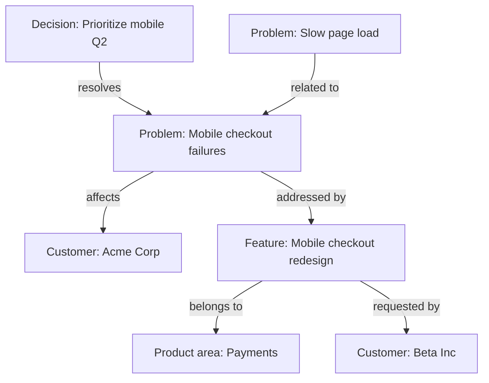
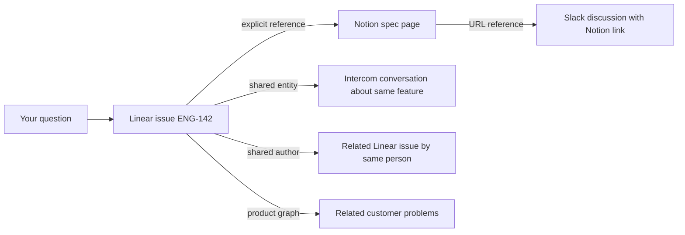

Ravell doesn't just search your tools — it builds a knowledge graph that connects documents across Linear, Notion, Intercom, Slack, and Attio. This page explains how that works under the hood.

---

## How documents are linked

When Ravell indexes a document, it creates links to related documents. These links are what make cross-tool answers possible.

| Link type | How it works | Example |
|-----------|--------------|---------|
| **Explicit reference** | A document mentions an identifier (e.g. ENG-142); Ravell links to the indexed document with that identifier | A Notion page that mentions "see ENG-142" links to that Linear issue |
| **Shared entity** | Two documents mention the same person, project, or entity — linked by meaning, not just text | An Intercom conversation and a Linear issue both mention "Project X" — they get linked |
| **Same thread** | A document is a reply or child of another | An Intercom message links to its parent conversation |
| **Shared author** | The same person authored both documents | Two Linear issues by the same assignee, created around the same time, get linked |
| **URL reference** | A document contains a URL that matches another indexed document | A Slack message with a Notion link connects to that Notion page |
| **Theme match** | Two documents share a common theme or topic based on content analysis | A customer feedback conversation and a project spec about the same feature get linked |

---

## Entity resolution

Ravell identifies entities — people, projects, teams, companies, features, and problems — mentioned across your tools and resolves them to the same underlying concept.

For example, "Project Phoenix", "the Phoenix project", and "ENG-Phoenix" might all refer to the same Linear project. Ravell recognizes these as the same entity and links documents that reference it, even when they use different names.

Entity resolution works across sources: a customer mentioned in Intercom, a project in Linear, and a discussion in Slack can all be connected if they reference the same entity. Ravell maintains **entity aliases** (alternative names) and **cross-platform identities** (linking Slack user IDs to Linear users to Intercom contacts) so that the same person or concept is recognized regardless of which tool it appears in.

---

## Product graph

Beyond linking documents, Ravell builds a **product graph** — a structured model of your product's problems, features, decisions, and product areas, along with the relationships between them.

### What the product graph tracks

| Entity type | Description | Example |
|-------------|-------------|---------|
| **Problem** | Customer pain points and issues surfaced from feedback and support | "Users can't complete checkout on mobile" |
| **Feature** | Product capabilities, both existing and requested | "Mobile-optimized checkout flow" |
| **Decision** | Product decisions recorded in your tools | "Prioritize mobile checkout for Q2" |
| **Product area** | Structural categories that organize your product | "Payments", "Onboarding", "Mobile" |

### How entities are connected

The product graph captures the relationships between these entities:

These relationships are extracted automatically from your connected sources and refined over time. Each relationship carries a **confidence score** based on how it was discovered — explicit references and metadata-based links score higher than co-mentions.

### Blind spot detection

The product graph enables **blind spot detection**: identifying problems that don't have a corresponding feature or decision addressing them. This surfaces gaps in your roadmap — customer pain points that may not yet be on your team's radar.

### How the product graph improves answers

When you ask questions like:
- "What customer problems are we not addressing?"
- "Which features map to the most customer complaints?"
- "What decisions have we made about the checkout flow?"

Ravell uses the product graph to find structured, relationship-aware answers rather than just keyword matches. The product graph serves as an additional retrieval lane alongside semantic and lexical search.

---

## Graph expansion during retrieval

When you ask a question, Ravell doesn't just return documents that match your search terms. It follows the links in the knowledge graph to discover related evidence.

In this example, asking about "ENG-142" surfaces not just the issue itself but:
- The Notion spec page that references it
- Intercom conversations about the same feature
- Related issues by the same author
- Slack discussions that linked to the spec
- Related customer problems from the product graph

This is why Ravell can answer questions like "What do we know about the checkout feature?" even when the relevant information is scattered across four different tools with different terminology.

---

## Source quality tracking

Ravell tracks the quality and reliability of evidence from each source through the **Source Reality** system. Each data source in your workspace is scored across multiple dimensions:

- **Freshness** — How recently the source was updated
- **Signal-to-noise** — How much useful content the source contains relative to noise
- **Actionability** — How likely the source is to contain information you can act on
- **Structure** — How well-organized the source's content is
- **Source of truth** — Whether the source is the canonical reference for a topic

Ravell also tracks **behavioral signals** — how often a source's content gets cited in answers and how often it leads to helpful results. Sources that consistently produce useful evidence are prioritized in future searches.

These scores are combined into a **composite selection score** that determines which sources to prioritize for a given query intent. This means Ravell doesn't just search everywhere — it routes queries to the sources most likely to have the best answer.

---

## How the graph improves over time

The knowledge graph gets richer as you use Ravell:

- **More documents** mean more potential links between sources
- **More users** create more conversations, which surface more entity references
- **More sources** add more cross-tool connections
- **More questions** improve behavioral signals, helping Ravell learn which sources are most useful for different types of queries
- **More feedback** helps the product graph build a more complete picture of your product's problems, features, and decisions

This is the data flywheel: better linking leads to better retrieval, which leads to better answers, which attracts more usage.

---

## Related

<CardGroup cols={2}>
  <Card title="System overview" icon="diagram-project" href="/system-overview">
    The full architecture from question to answer.
  </Card>
  <Card title="Managing sources" icon="plug" href="/sources">
    Connect and manage your integrations.
  </Card>
  <Card title="Knowledge API" icon="code" href="/knowledge-api">
    Programmatic access to search and query your data.
  </Card>
</CardGroup>
