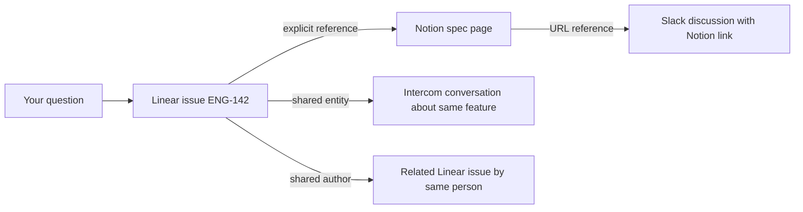

Ravell doesn't just search your tools — it builds a knowledge graph that connects documents across Linear, Notion, Intercom, Slack, and Attio. On top of that document layer, a **product graph** identifies recurring problems, feature requests, and topics from your data and scores them by priority.

---

## How documents are linked

When Ravell indexes a document, it creates links to related documents. These links are what make cross-tool answers possible.

| Link type | How it works | Example |
|-----------|--------------|---------|
| **Explicit reference** | A document mentions an identifier (e.g. ENG-142); Ravell links to the indexed document with that identifier | A Notion page that mentions "see ENG-142" links to that Linear issue |
| **Shared entity** | Two documents mention the same person, project, or entity — linked by meaning, not just text | An Intercom conversation and a Linear issue both mention "Project X" — they get linked |
| **Same thread** | A document is a reply or child of another | An Intercom message links to its parent conversation |
| **Shared author** | The same person authored both documents | Two Linear issues by the same assignee, created around the same time, get linked |
| **URL reference** | A document contains a URL that matches another indexed document | A Slack message with a Notion link connects to that Notion page |

---

## Entity resolution

Ravell identifies entities — people, projects, teams, features, and problems — mentioned across your tools and resolves them to the same underlying concept.

For example, "Project Phoenix", "the Phoenix project", and "ENG-Phoenix" might all refer to the same Linear project. Ravell recognizes these as the same entity and links documents that reference it, even when they use different names.

Entity resolution works across sources: a customer mentioned in Intercom, a project in Linear, and a discussion in Slack can all be connected if they reference the same entity.

---

## Product graph

The product graph is a structured layer on top of the knowledge graph. While the knowledge graph connects documents, the product graph identifies and tracks **what your customers care about** — recurring problems, feature requests, and the topics that group them.

### Entity types

Ravell extracts three types of product entities from your indexed documents:

| Entity type | What it represents | Example |
|-------------|-------------------|---------|
| **Problem** | A recurring customer pain point or product deficiency | "Checkout flow drops mobile users" |
| **Feature request** | A specific product improvement someone has asked for | "Add bulk export to CSV" |
| **Topic** | A broad functional domain that groups related problems and requests | "Payments", "Onboarding" |

### Problem subtypes

Every problem is classified into one of four subtypes so you can filter and prioritize by category:

| Subtype | What it means |
|---------|--------------|
| **Bug** | Something broken — crashes, errors, or behavior that doesn't match the design |
| **Feature gap** | A missing capability that customers need but the product lacks |
| **UX friction** | Something that works but frustrates users — slow, confusing, or hard to use |
| **Integration issue** | Problems with data source connections, syncs, or third-party integrations |

### How entities are extracted

Ravell uses multiple methods to identify product entities:

- **Metadata extraction** — Linear issue labels (e.g. "bug", "feature") and project assignments are mapped to problem and feature request entities automatically.
- **LLM extraction** — When a document is indexed, Ravell reads the content and identifies problems, feature requests, and topics with structured classification. Only high-confidence extractions (85%+) are promoted to the graph automatically.
- **Co-mention detection** — When two entities appear together in multiple documents, Ravell infers a relationship between them (e.g. a problem is related to a topic).

### Evidence and scoring

Each problem in the product graph is backed by evidence — the actual documents where customers or team members raised the issue. Ravell scores problems using five signals:

| Signal | Weight | What it measures |
|--------|--------|-----------------|
| **Source diversity** | Highest | How many different source types mention this problem (e.g. Slack + Linear + Intercom scores higher than Intercom alone) |
| **Evidence volume** | High | How many distinct evidence sources back this problem, scaled logarithmically |
| **Recency** | Medium | How recently the problem was mentioned, with a 30-day half-life |
| **Engagement** | Medium | Whether your team has interacted with this problem (viewed, followed up, dismissed) |
| **Confidence** | Low | Average extraction confidence — used as a tiebreaker |

Problems need evidence from at least two distinct sources to appear in rankings. This filters out single-source noise so only validated patterns surface.

<Tip>
Evidence is grouped by parent document to prevent inflated counts. For example, 18 comments on a single Linear issue count as one evidence source, not 18.
</Tip>

### Blind spots

Ravell identifies **blind spots** — problems that are rising in mentions but have no planned response. A blind spot means:

- The problem has no linked feature request addressing it
- Evidence mentions increased in the last two weeks
- The rate of new mentions is at least double the baseline

Blind spots help you catch emerging issues before they become urgent.

### Velocity tracking

Each problem includes a velocity trend based on recent vs. historical mention rates:

- **Rising** — mentions are accelerating (2x or more above baseline)
- **Steady** — mentions are consistent
- **Declining** — mentions are dropping

This helps you distinguish persistent issues from ones that are naturally resolving.

---

## Graph expansion during retrieval

When you ask a question, Ravell doesn't just return documents that match your search terms. It follows the links in the knowledge graph to discover related evidence.

In this example, asking about "ENG-142" surfaces not just the issue itself but:
- The Notion spec page that references it
- Intercom conversations about the same feature
- Related issues by the same author
- Slack discussions that linked to the spec

This is why Ravell can answer questions like "What do we know about the checkout feature?" even when the relevant information is scattered across four different tools with different terminology.

---

## Source quality tracking

Ravell tracks the quality and reliability of evidence from each source:

- **Freshness**: How recently the document was created or updated
- **Completeness**: Whether the document has enough content to be useful
- **Relevance signals**: How often a document appears in successful answers

This quality tracking helps Ravell prioritize better evidence when multiple documents cover the same topic.

---

## How the graph improves over time

The knowledge graph gets richer as you use Ravell:

- **More documents** mean more potential links between sources
- **More users** create more conversations, which surface more entity references
- **More sources** add more cross-tool connections
- **Your interactions** feed back into the product graph — viewing, following up on, or dismissing problems adjusts their priority scores over time

This is the data flywheel: better linking leads to better retrieval, which leads to better answers, which attracts more usage.

---

## Related

<CardGroup cols={2}>
  <Card title="System overview" icon="diagram-project" href="/system-overview">
    The full architecture from question to answer.
  </Card>
  <Card title="Managing sources" icon="plug" href="/sources">
    Connect and manage your integrations.
  </Card>
</CardGroup>
