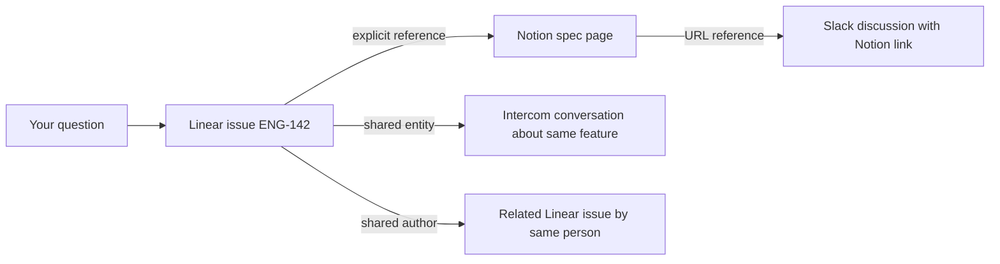

Ravell doesn't just search your tools — it builds a knowledge graph that connects documents across Linear, Notion, Intercom, Slack, and Attio. This page explains how document linking, entity resolution, semantic deduplication, and the product graph work under the hood.

---

## How documents are linked

When Ravell indexes a document, it creates links to related documents. These links are what make cross-tool answers possible.

| Link type | How it works | Example |
|-----------|--------------|---------|
| **Explicit reference** | A document mentions an identifier (e.g. ENG-142); Ravell links to the indexed document with that identifier | A Notion page that mentions "see ENG-142" links to that Linear issue |
| **Shared entity** | Two documents mention the same person, project, or entity — linked by meaning, not just text | An Intercom conversation and a Linear issue both mention "Project X" — they get linked |
| **Same thread** | A document is a reply or child of another | An Intercom message links to its parent conversation |
| **Shared author** | The same person authored both documents | Two Linear issues by the same assignee, created around the same time, get linked |
| **URL reference** | A document contains a URL that matches another indexed document | A Slack message with a Notion link connects to that Notion page |

---

## Entity resolution

Ravell identifies entities — people, companies, customers, and teams — mentioned across your tools and resolves them to the same underlying concept.

For example, "Acme Corp", "Acme Inc", and "acme" might all refer to the same company. Ravell normalizes these names, matches them against known aliases, and links documents that reference the same entity — even when they use different names or spellings.

### Cross-platform identity linking

Each tool has its own user and contact system. Ravell syncs identities from every connected integration and links them into canonical entity profiles:

- **Slack** users, **Linear** team members, **Intercom** contacts, **Notion** users, and **Attio** records are all synced
- Identities sharing the same email address are merged into one entity profile
- For companies, domain matching connects records across tools — a Linear customer with `acmecorp.com` merges with the matching Intercom company and Attio record

When you ask about "Sarah Kim", Ravell resolves the name against the unified entity graph and finds every document connected to that person — regardless of which tool it came from or what name was used.

### How name matching works

Ravell uses a multi-step process to match entity names:

1. **Normalization** — names are lowercased, punctuation is stripped, unicode is transliterated, and common suffixes like "Inc", "Corp", "LLC", and "Ltd" are removed. This means "Acme Inc." and "acme" produce the same normalized form.
2. **Alias lookup** — each entity can have multiple aliases (alternative names). When a name appears in a document, Ravell checks it against all known aliases to find a match.
3. **Confidence scoring** — matches are scored by confidence. Explicit metadata (like a Slack user ID) scores highest, followed by platform identity matches, then email-based matches. When the top two matches are too close in confidence, Ravell flags the result as ambiguous rather than guessing.

### Semantic matching

When a name doesn't match any existing alias exactly, Ravell uses **embedding-based semantic matching** to find near-duplicates:

- Each entity profile has a vector embedding generated from its name and description
- New names are compared against existing entities using cosine similarity
- If similarity exceeds the matching threshold, the existing entity is reused and the new name is registered as an alias for future lookups

This prevents the graph from fragmenting into duplicate entries when the same concept is described slightly differently across tools.

---

## Entity deduplication

Over time, the same entity can be created independently from different sources. Ravell automatically detects and merges duplicates.

### Auto-merge

Ravell periodically scans for entity pairs with very high semantic similarity. When two entities of the same type are near-identical (based on their embeddings), they are automatically merged:

- The entity with more evidence is kept as the canonical version
- All document mentions, relationships, and evidence from the duplicate are transferred to the survivor
- The duplicate's name becomes an alias on the canonical entity
- Merges are recorded in metadata so they can be reviewed or reversed

### Merge suggestions

Entity pairs that are similar but not identical enough for auto-merge are surfaced as suggestions for human review. This lets you confirm or reject potential merges before they happen.

### Unmerging

If an automatic or manual merge was incorrect, you can reverse it. Unmerging restores the original entity, transfers back its document mentions and relationships, and removes the alias that was created during the merge.

---

## Product graph

Built on top of the knowledge graph, the **product graph** is an intelligence layer that extracts product-relevant concepts from your documents and tracks how they evolve over time.

<Note>
The product graph is an advanced feature that may not be enabled for all workspaces. Contact your workspace admin if you don't see product graph data.
</Note>

### What it extracts

The product graph identifies three types of product entities from your documents:

| Entity type | What it captures | Example |
|-------------|------------------|---------|
| **Problem** | Issues, bugs, friction points, and feature gaps your customers experience | "Checkout timeout on mobile devices", "CSV export missing headers" |
| **Feature request** | Specific capabilities or improvements customers or teammates have asked for | "Add bulk import for contacts", "Support SSO with Okta" |
| **Topic** | Recurring themes or product areas that group related problems and requests | "Onboarding flow", "Billing integration" |

Problems are further classified by subtype: **bug**, **feature gap**, **UX friction**, or **integration issue**.

### How extraction works

When a document is indexed, Ravell runs it through an extraction pipeline:

1. **Metadata linking** — entities are linked from structured fields (e.g. a Linear issue's assignee, an Intercom conversation's contact)
2. **LLM extraction** — an AI model reads the document content and identifies product problems, feature requests, and topics mentioned in it
3. **Resolution** — extracted entities are matched against the existing graph using exact-match aliases first, then semantic similarity, to avoid creating duplicates
4. **Relationship mapping** — connections between entities are recorded (e.g. a problem affects a customer, a feature request addresses a problem, a feature request is grouped by topic)
5. **Evidence scoring** — each extraction is scored for confidence based on the source quality, extraction method, and corroborating evidence

### Priority scoring

Ravell scores problems by combining multiple signals to surface the most important issues:

- **Evidence volume** — how many documents mention the problem
- **Source diversity** — problems mentioned across multiple tools (e.g. both Slack and Intercom) rank higher than those from a single source
- **Recency** — recently mentioned problems score higher, with gradual decay over time
- **Confidence** — higher-confidence extractions contribute more to the score
- **Engagement** — problems you've interacted with (viewed, investigated, discussed) get a boost

### Blind spot detection

Ravell identifies **rising problems** that may need attention — issues with increasing mention frequency that don't yet have a feature request or solution addressing them. These blind spots help you catch emerging issues before they become widespread.

### Velocity and trends

Each product entity has a velocity signal based on how its mention frequency changes over time:

- **Rising** — mentions are increasing compared to the baseline period
- **Steady** — mentions are stable
- **Declining** — mentions are decreasing

This helps you distinguish between persistent issues and emerging ones.

---

## Graph expansion during retrieval

When you ask a question, Ravell doesn't just return documents that match your search terms. It follows the links in the knowledge graph to discover related evidence.

In this example, asking about "ENG-142" surfaces not just the issue itself but:
- The Notion spec page that references it
- Intercom conversations about the same feature
- Related issues by the same author
- Slack discussions that linked to the spec

This is why Ravell can answer questions like "What do we know about the checkout feature?" even when the relevant information is scattered across four different tools with different terminology.

---

## Source quality tracking

Ravell tracks the quality and reliability of evidence from each source:

- **Freshness**: How recently the document was created or updated
- **Completeness**: Whether the document has enough content to be useful
- **Relevance signals**: How often a document appears in successful answers

This quality tracking helps Ravell prioritize better evidence when multiple documents cover the same topic.

---

## How the graph improves over time

The knowledge graph gets richer as you use Ravell:

- **More documents** mean more potential links between sources
- **More users** create more conversations, which surface more entity references
- **More sources** add more cross-tool connections
- **Entity resolution improves** as more cross-platform identities are merged and aliases accumulate
- **Product graph sharpens** as more evidence confirms or refines extracted problems and feature requests

This is the data flywheel: better linking leads to better retrieval, which leads to better answers, which attracts more usage.

---

## Related

<CardGroup cols={2}>
  <Card title="System overview" icon="diagram-project" href="/system-overview">
    The full architecture from question to answer.
  </Card>
  <Card title="Managing sources" icon="plug" href="/sources">
    Connect and manage your integrations.
  </Card>
</CardGroup>
