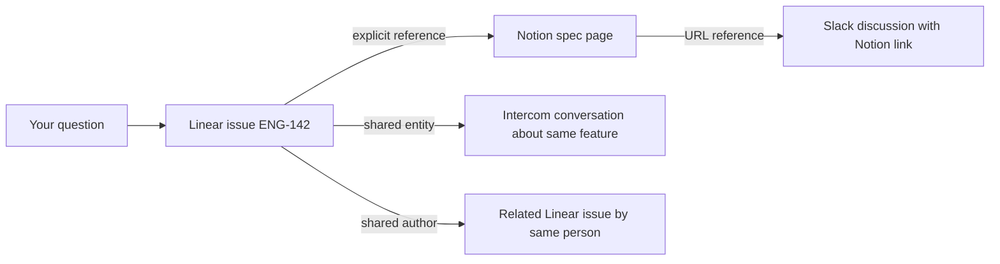

Ravell doesn't just search your tools — it builds a knowledge graph that connects documents across Linear, Notion, Intercom, Slack, and Attio. On top of the document graph, the **Product Graph** extracts and tracks problems, feature requests, and topics to give you a structured view of product intelligence. This page explains how both layers work.

---

## How documents are linked

When Ravell indexes a document, it creates links to related documents. These links are what make cross-tool answers possible.

| Link type | How it works | Example |
|-----------|--------------|---------|
| **Explicit reference** | A document mentions an identifier (e.g. ENG-142); Ravell links to the indexed document with that identifier | A Notion page that mentions "see ENG-142" links to that Linear issue |
| **Shared entity** | Two documents mention the same person, project, or entity — linked by meaning, not just text | An Intercom conversation and a Linear issue both mention "Project X" — they get linked |
| **Same thread** | A document is a reply or child of another | An Intercom message links to its parent conversation |
| **Shared author** | The same person authored both documents | Two Linear issues by the same assignee, created around the same time, get linked |
| **URL reference** | A document contains a URL that matches another indexed document | A Slack message with a Notion link connects to that Notion page |

---

## Entity resolution

Ravell identifies entities — people, projects, teams, features — mentioned across your tools and resolves them to the same underlying concept.

For example, "Project Phoenix", "the Phoenix project", and "ENG-Phoenix" might all refer to the same Linear project. Ravell recognizes these as the same entity and links documents that reference it, even when they use different names.

Entity resolution works across sources: a customer mentioned in Intercom, a project in Linear, and a discussion in Slack can all be connected if they reference the same entity.

---

## Graph expansion during retrieval

When you ask a question, Ravell doesn't just return documents that match your search terms. It follows the links in the knowledge graph to discover related evidence.

In this example, asking about "ENG-142" surfaces not just the issue itself but:
- The Notion spec page that references it
- Intercom conversations about the same feature
- Related issues by the same author
- Slack discussions that linked to the spec

This is why Ravell can answer questions like "What do we know about the checkout feature?" even when the relevant information is scattered across four different tools with different terminology.

---

## Product Graph

The **Product Graph** is a structured layer on top of the document graph. It extracts entities from your indexed data and tracks them over time so you can see what matters most across your product.

### Entity types

| Entity type | What it represents | Example |
|-------------|-------------------|---------|
| **Problem** | A pain point, bug, or issue affecting users | "Checkout timeout errors on mobile" |
| **Feature request** | Something users or the team want built | "Add CSV export to the dashboard" |
| **Topic** | A recurring theme or product area | "Onboarding flow", "API performance" |

Entities are extracted automatically when documents are indexed. Ravell uses multiple extraction methods — metadata matching, LLM analysis, co-mentions, theme detection, and explicit references — to build a high-confidence picture.

### Ranked problems

The Product Graph ranks problems by combining mention frequency, velocity (how fast mentions are growing), customer impact, and recency. Problems decay over time (older problems lose priority unless they keep being mentioned), so the ranking reflects what matters *now*.

Ask Ravell about problems directly:

- "What are the top problems our customers face?"
- "Which issues are growing fastest this month?"

### Blind spots

Blind spots are problems or feature requests that are rising in mentions but not yet getting attention in your Linear backlog. These are the gaps between what customers are saying and what the team is working on.

- "What are we missing in our backlog?"
- "Show me blind spots in customer feedback"

### Browse entities

You can browse and search entities in the Product Graph by type. Each entity shows its supporting assertions (the evidence linking it to documents), relationships to other entities, and mention history.

### Weekly product intelligence brief

You can set up a **weekly brief** that summarizes the most important product intelligence — top problems, blind spots, velocity changes, and new patterns — and delivers it to a Slack channel. The brief runs automatically on a schedule you configure.

To set up a weekly brief:

1. Open **Agents** and create a new agent.
2. Choose the **Product intelligence brief** type.
3. Select a Slack channel for delivery and configure the schedule.
4. Save. The brief runs at the scheduled time and posts to Slack.

You can also trigger a test brief immediately to preview the output before the first scheduled run.

---

## Source quality tracking

Ravell tracks the quality and reliability of evidence from each source:

- **Freshness**: How recently the document was created or updated.
- **Completeness**: Whether the document has enough content to be useful.
- **Relevance signals**: How often a source is cited in successful answers.

This quality tracking helps Ravell prioritize better evidence when multiple documents cover the same topic. Sources that consistently produce cited evidence get higher selection priority, while underused sources are occasionally explored to discover new value.

---

## How the graph improves over time

The knowledge graph gets richer as you use Ravell:

- **More documents** mean more potential links between sources.
- **More users** create more conversations, which surface more entity references.
- **More sources** add more cross-tool connections.
- **Product Graph entities** get refined as new evidence arrives — problems merge, confidence increases, and stale entities decay.

This is the data flywheel: better linking leads to better retrieval, which leads to better answers, which attracts more usage.

---

## Related

<CardGroup cols={2}>
  <Card title="System overview" icon="diagram-project" href="/system-overview">
    The full architecture from question to answer.
  </Card>
  <Card title="Managing sources" icon="plug" href="/sources">
    Connect and manage your integrations.
  </Card>
</CardGroup>
