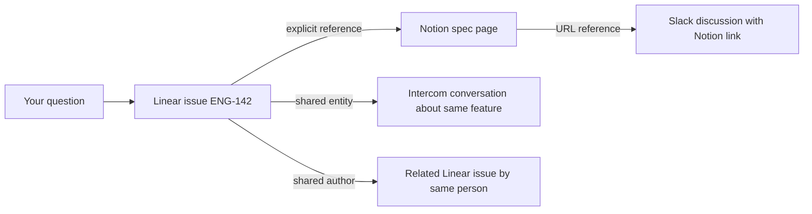

Ravell doesn't just search your tools — it builds a knowledge graph that connects documents across Linear, Notion, Intercom, Slack, and Attio. This page explains how that works under the hood.

---

## How documents are linked

When Ravell indexes a document, it creates links to related documents. These links are what make cross-tool answers possible.

| Link type | How it works | Example |
|-----------|--------------|---------|
| **Explicit reference** | A document mentions an identifier (e.g. ENG-142); Ravell links to the indexed document with that identifier | A Notion page that mentions "see ENG-142" links to that Linear issue |
| **Shared entity** | Two documents mention the same person, project, or entity — linked by meaning, not just text | An Intercom conversation and a Linear issue both mention "Project X" — they get linked |
| **Same thread** | A document is a reply or child of another | An Intercom message links to its parent conversation |
| **Shared author** | The same person authored both documents | Two Linear issues by the same assignee, created around the same time, get linked |
| **URL reference** | A document contains a URL that matches another indexed document | A Slack message with a Notion link connects to that Notion page |

---

## Entity resolution

Ravell identifies entities — people, projects, teams, features — mentioned across your tools and resolves them to the same underlying concept.

For example, "Project Phoenix", "the Phoenix project", and "ENG-Phoenix" might all refer to the same Linear project. Ravell recognizes these as the same entity and links documents that reference it, even when they use different names.

Entity resolution works across sources: a customer mentioned in Intercom, a project in Linear, and a discussion in Slack can all be connected if they reference the same entity.

---

## Graph expansion during retrieval

When you ask a question, Ravell doesn't just return documents that match your search terms. It follows the links in the knowledge graph to discover related evidence.

In this example, asking about "ENG-142" surfaces not just the issue itself but:
- The Notion spec page that references it
- Intercom conversations about the same feature
- Related issues by the same author
- Slack discussions that linked to the spec

This is why Ravell can answer questions like "What do we know about the checkout feature?" even when the relevant information is scattered across four different tools with different terminology.

---

## Source quality tracking

Ravell tracks the quality and reliability of evidence from each source:

- **Freshness**: How recently the document was created or updated
- **Completeness**: Whether the document has enough content to be useful
- **Relevance signals**: How often a document appears in successful answers

This quality tracking helps Ravell prioritize better evidence when multiple documents cover the same topic.

---

## How the graph improves over time

The knowledge graph gets richer as you use Ravell:

- **More documents** mean more potential links between sources
- **More users** create more conversations, which surface more entity references
- **More sources** add more cross-tool connections

This is the data flywheel: better linking leads to better retrieval, which leads to better answers, which attracts more usage.

---

## Related

<CardGroup cols={2}>
  <Card title="Product Intelligence" icon="chart-mixed" href="/product-intelligence">
    See how Ravell turns the knowledge graph into ranked problems and trends.
  </Card>
  <Card title="System overview" icon="diagram-project" href="/system-overview">
    The full architecture from question to answer.
  </Card>
  <Card title="Managing sources" icon="plug" href="/sources">
    Connect and manage your integrations.
  </Card>
</CardGroup>
