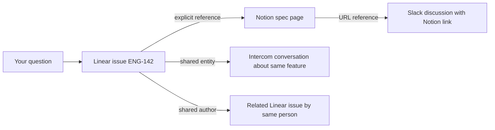

Ravell doesn't just search your tools — it builds a knowledge graph that connects documents across Linear, Notion, Intercom, Slack, and Attio. On top of that, a **product graph** layer automatically extracts product problems, scores their priority, and surfaces blind spots. This page explains how both layers work under the hood.

---

## How documents are linked

When Ravell indexes a document, it creates links to related documents. These links are what make cross-tool answers possible.

| Link type | How it works | Example |
|-----------|--------------|---------|
| **Explicit reference** | A document mentions an identifier (e.g. ENG-142); Ravell links to the indexed document with that identifier | A Notion page that mentions "see ENG-142" links to that Linear issue |
| **Shared entity** | Two documents mention the same person, project, or entity — linked by meaning, not just text | An Intercom conversation and a Linear issue both mention "Project X" — they get linked |
| **Same thread** | A document is a reply or child of another | An Intercom message links to its parent conversation |
| **Shared author** | The same person authored both documents | Two Linear issues by the same assignee, created around the same time, get linked |
| **URL reference** | A document contains a URL that matches another indexed document | A Slack message with a Notion link connects to that Notion page |

---

## Entity resolution

Ravell identifies entities — people, projects, teams, features — mentioned across your tools and resolves them to the same underlying concept.

For example, "Project Phoenix", "the Phoenix project", and "ENG-Phoenix" might all refer to the same Linear project. Ravell recognizes these as the same entity and links documents that reference it, even when they use different names.

Entity resolution works across sources: a customer mentioned in Intercom, a project in Linear, and a discussion in Slack can all be connected if they reference the same entity.

---

## Graph expansion during retrieval

When you ask a question, Ravell doesn't just return documents that match your search terms. It follows the links in the knowledge graph to discover related evidence.

In this example, asking about "ENG-142" surfaces not just the issue itself but:
- The Notion spec page that references it
- Intercom conversations about the same feature
- Related issues by the same author
- Slack discussions that linked to the spec

This is why Ravell can answer questions like "What do we know about the checkout feature?" even when the relevant information is scattered across four different tools with different terminology.

---

## Source quality tracking

Ravell tracks the quality and reliability of evidence from each source:

- **Freshness**: How recently the document was created or updated
- **Completeness**: Whether the document has enough content to be useful
- **Relevance signals**: How often a document appears in successful answers

This quality tracking helps Ravell prioritize better evidence when multiple documents cover the same topic.

---

## Product graph

The product graph is a layer built on top of the knowledge graph that automatically identifies **product problems**, **feature requests**, and **topics** from your indexed documents. Instead of you manually tagging issues or triaging feedback, Ravell extracts these entities, links them to evidence, and ranks them by priority.

### How problems are extracted

When Ravell indexes a document — a Slack thread, Intercom conversation, Linear issue, or Notion page — it runs an extraction pipeline:

1. **Metadata extraction** — Deterministic rules map structured data (like Linear issue labels) to entities. A "bug" label becomes a `problem` entity; a "feature request" label becomes a `feature_request` entity.
2. **LLM extraction** — An AI model reads the document content and identifies product problems, feature requests, and topics mentioned in it. Each extraction includes a confidence score.
3. **Quality gate** — A separate AI classifier filters out engineering-internal bugs (stack traces, database errors, infrastructure issues) so only user-facing product problems enter the graph.
4. **Entity resolution** — Extracted entities are matched against existing ones by name, alias, and semantic similarity. "Checkout page is slow" and "slow checkout flow" resolve to the same problem.
5. **Assertion creation** — Each extraction creates an assertion linking an entity to a document as evidence, with a confidence score and provenance metadata.

<Tip>
The quality gate ensures that internal engineering issues like "Sidekiq timeout during batch processing" are filtered out, while user-facing problems like "API returns errors when creating a workspace" are kept. If a non-technical person wouldn't understand the problem name, it doesn't belong in the product graph.
</Tip>

### How problems are scored

Every product problem is scored using a composite priority formula that weighs six signals:

| Signal | What it measures |
|--------|-----------------|
| **Evidence** | How many distinct sources mention this problem (logarithmic — the first few sources matter most) |
| **Recency** | How recently evidence appeared (exponential decay with a 30-day half-life) |
| **Diversity** | How many different tool types mention it (Slack + Intercom + Linear counts more than three Slack threads) |
| **Engagement** | Whether your team has interacted with this problem (viewed, explored, or dismissed) |
| **Velocity** | Whether evidence is increasing — proportion of mentions in the last 14 days vs. total |
| **Confidence** | Average extraction confidence across all assertions |

Problems with rising velocity — where most evidence appeared recently — surface higher. Problems your team has dismissed score lower. This scoring updates continuously as new documents are indexed.

### Blind spots

Ravell detects **blind spots** — product problems that are gaining evidence but have no feature request or initiative addressing them. A blind spot means customers are increasingly reporting a problem, but your team hasn't started working on a response.

Blind spots are ranked by severity: a problem with 5 new mentions in the last two weeks and zero in the prior two months scores higher than one with a steady trickle.

### Weekly product intelligence brief

You can enable a **weekly brief** that delivers a summary of your product graph to a Slack channel. The brief includes:

- **Rising problems** — Top problems ranked by priority score, with velocity indicators
- **Blind spots** — Uncovered rising problems that need attention
- **Improving problems** — Problems where evidence is declining after a feature shipped
- **Changes since last brief** — New entries, rank changes, and problems that dropped off
- **Possible duplicates** — Entity pairs that may refer to the same problem, suggested for merge

The brief is interactive — you can click "Tell me more" on any problem to get a detailed breakdown, or "Merge them" to combine duplicate entities.

### How the product graph improves over time

The product graph has a built-in learning loop. When you interact with problems — viewing them, asking follow-up questions, dismissing false positives, or merging duplicates — Ravell adjusts the engagement score for those entities. Over time, this means:

- Problems your team cares about surface higher
- False positives get suppressed
- Duplicate entities get merged into cleaner canonical entries
- The scoring reflects your team's actual priorities, not just raw mention counts

---

## How the graph improves over time

The knowledge graph gets richer as you use Ravell:

- **More documents** mean more potential links between sources
- **More users** create more conversations, which surface more entity references
- **More sources** add more cross-tool connections
- **More interactions** with the product graph improve scoring accuracy

This is the data flywheel: better linking leads to better retrieval, which leads to better answers, which attracts more usage.

---

## Related

<CardGroup cols={2}>
  <Card title="System overview" icon="diagram-project" href="/system-overview">
    The full architecture from question to answer.
  </Card>
  <Card title="Managing sources" icon="plug" href="/sources">
    Connect and manage your integrations.
  </Card>
</CardGroup>
