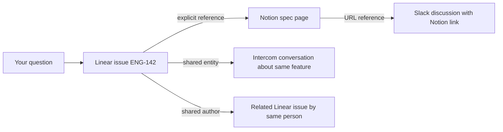

Ravell doesn't just search your tools — it builds a knowledge graph that connects documents across Linear, Notion, Intercom, Slack, and Attio. This page explains how that works under the hood.

---

## How documents are linked

When Ravell indexes a document, it creates links to related documents. These links are what make cross-tool answers possible.

| Link type | How it works | Example |
|-----------|--------------|---------|
| **Explicit reference** | A document mentions an identifier (e.g. ENG-142); Ravell links to the indexed document with that identifier | A Notion page that mentions "see ENG-142" links to that Linear issue |
| **Shared entity** | Two documents mention the same person, project, or entity — linked by meaning, not just text | An Intercom conversation and a Linear issue both mention "Project X" — they get linked |
| **Same thread** | A document is a reply or child of another | An Intercom message links to its parent conversation |
| **Shared author** | The same person authored both documents | Two Linear issues by the same assignee, created around the same time, get linked |
| **URL reference** | A document contains a URL that matches another indexed document | A Slack message with a Notion link connects to that Notion page |

---

## Entity resolution

Ravell identifies entities — people, projects, teams, features — mentioned across your tools and resolves them to the same underlying concept.

For example, "Project Phoenix", "the Phoenix project", and "ENG-Phoenix" might all refer to the same Linear project. Ravell recognizes these as the same entity and links documents that reference it, even when they use different names.

Entity resolution works across sources: a customer mentioned in Intercom, a project in Linear, and a discussion in Slack can all be connected if they reference the same entity.

---

## Graph expansion during retrieval

When you ask a question, Ravell doesn't just return documents that match your search terms. It follows the links in the knowledge graph to discover related evidence.

In this example, asking about "ENG-142" surfaces not just the issue itself but:
- The Notion spec page that references it
- Intercom conversations about the same feature
- Related issues by the same author
- Slack discussions that linked to the spec

This is why Ravell can answer questions like "What do we know about the checkout feature?" even when the relevant information is scattered across four different tools with different terminology.

---

## Source quality tracking

Ravell tracks the quality and reliability of evidence from each source:

- **Freshness**: How recently the document was created or updated
- **Completeness**: Whether the document has enough content to be useful
- **Relevance signals**: How often a document appears in successful answers

This quality tracking helps Ravell prioritize better evidence when multiple documents cover the same topic.

---

## Product graph

On top of document linking and entity resolution, Ravell builds a **product graph** — a structured layer that identifies product-level concepts and the relationships between them. While the knowledge graph connects documents, the product graph connects ideas: which problems your customers face, which features address them, and where blind spots remain.

### What the product graph tracks

The product graph works with four entity types and the relationships between them:

| Entity type | What it represents | Example |
|-------------|-------------------|---------|
| **Problem** | A customer pain point or bug | "Checkout timeout on mobile" |
| **Feature** | A capability or planned improvement | "Retry logic for payment flow" |
| **Decision** | A product decision or prioritization call | "Defer mobile checkout redesign to Q3" |
| **Product area** | A high-level area of your product | "Payments", "Onboarding" |

Ravell automatically discovers these entities from your connected sources and creates relationships such as:

- A **feature addresses a problem** — linking a feature request to the pain point it solves
- A **problem is related to another problem** — grouping recurring themes
- A **decision resolves a problem** — tracking what was decided and why
- A **feature belongs to a product area** — organizing features by domain

### How entities are extracted

Ravell uses multiple extraction methods, each suited to different signals:

- **Metadata extraction** — Deterministic rules that map structured data to entities. For example, a Linear issue labeled "bug" becomes a `problem` entity, and a Linear project becomes a `product_area` entity. No AI model is involved, so these are fast and reliable.
- **Co-mention analysis** — When two entities appear in the same document, Ravell checks whether the relationship makes sense given their types and creates a link if it does. For example, if a problem and a feature are both mentioned in the same Notion page, Ravell links them.
- **LLM extraction** — For documents with enough content, an AI model extracts entities and relationships along with supporting evidence from the text. This catches nuanced connections that rules alone would miss.

Each extraction produces an **assertion** — a claim about a relationship with a confidence score. Assertions go through a review pipeline before becoming part of the active graph. High-confidence deterministic extractions are promoted automatically, while lower-confidence claims stay pending until corroborated by additional evidence.

### Problem prioritization

Ravell scores problems based on four factors:

| Factor | What it measures |
|--------|-----------------|
| **Evidence strength** | How many documents mention this problem |
| **Confidence** | How reliable the supporting evidence is |
| **Recency** | How recently the problem was reported |
| **Source diversity** | How many different tools (Linear, Intercom, Slack, etc.) mention it |

Problems with strong, recent, diverse evidence rank highest. You can use this to identify your most pressing customer issues across all sources without manually triaging each tool.

### Blind spot detection

Ravell identifies **blind spots** — problems that are rising in frequency but have no feature or decision addressing them. A blind spot means customers are increasingly mentioning a pain point, but your team hasn't started working on it yet.

Blind spots are detected by comparing recent evidence volume (last 14 days) against a longer baseline (last 90 days). If a problem's mentions are increasing and no related feature or decision exists, it surfaces as a blind spot with a severity score.

### How the product graph fits into retrieval

When you ask a question, the product graph acts as an additional retrieval lane alongside semantic and lexical search. If your question matches a tracked problem or feature, Ravell pulls in the related assertions and their source documents. This means a question like "What are the biggest customer pain points?" draws on structured product intelligence, not just keyword matches.

---

## How the graph improves over time

The knowledge graph gets richer as you use Ravell:

- **More documents** mean more potential links between sources
- **More users** create more conversations, which surface more entity references
- **More sources** add more cross-tool connections
- **More evidence** strengthens the product graph — assertions gain confidence as problems are mentioned across multiple sources, and blind spots surface earlier

This is the data flywheel: better linking leads to better retrieval, which leads to better answers, which attracts more usage.

---

## Related

<CardGroup cols={2}>
  <Card title="System overview" icon="diagram-project" href="/system-overview">
    The full architecture from question to answer.
  </Card>
  <Card title="Managing sources" icon="plug" href="/sources">
    Connect and manage your integrations.
  </Card>
</CardGroup>
