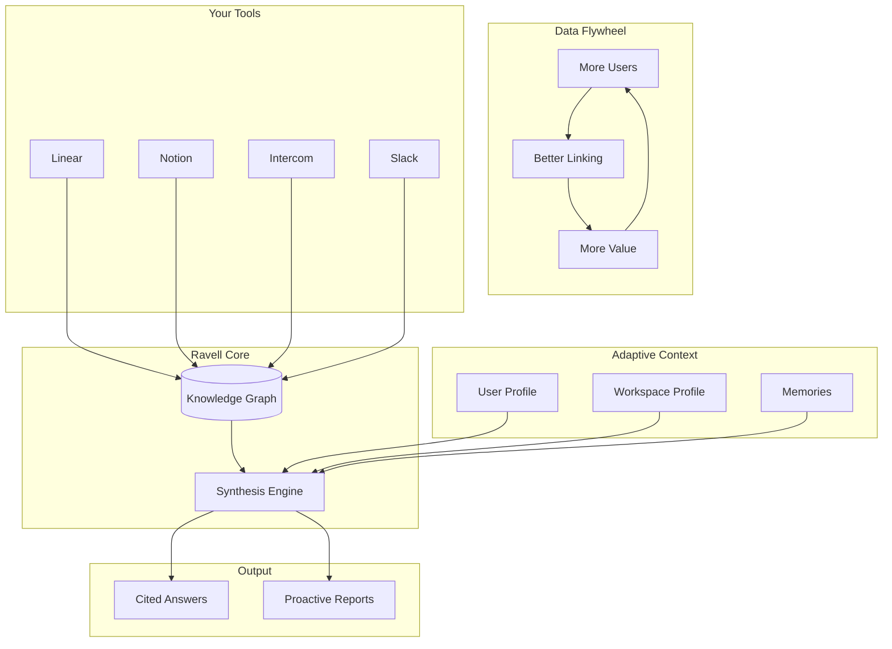

Ravell turns your product tools into a single source of truth for product intelligence. The system ingests data from your connected tools, enriches it with adaptive context, and produces evidence-backed answers and proactive reports.

---

## Architecture at a glance

The diagram below shows how data flows through Ravell: from your tools into a knowledge layer, combined with adaptive context, and synthesized into cited answers and proactive reports.

---

## From question to answer

When you ask a question, Ravell runs a structured pipeline that turns your words into evidence-backed answers. Here's how it works:

1. **Understand** — Ravell classifies what you're asking (e.g. find issues, summarize feedback, compare trends) and resolves references like "Project X" or "ENG-142" to real items in your workspace.
2. **Plan** — It breaks the query into sub-questions and selects which sources to search. A simple lookup gets a quick pass; a complex question gets more retrieval passes.
3. **Search** — Ravell searches in several ways at once:
   - **By meaning** — semantic search finds relevant content even when it's phrased differently
   - **By exact text** — lexical search catches specific terms and phrases
   - **By structure** — filters by team, status, date, source
   - **By links** — follows document connections to find related evidence (e.g. an issue that references a Notion page)
4. **Fuse & rank** — Results from all lanes are merged so no single method dominates, then re-ranked so the best evidence surfaces first.
5. **Synthesize** — For complex questions, evidence is clustered by theme and distilled into key points before the answer is written. Every claim is tied to a source.
6. **Verify** — A final check ensures claims match the evidence and marks confidence where needed.

You see this progress as **streaming thoughts** — short status updates like "Breaking the query into sub-questions...", "Searching Linear, Intercom...", "Synthesizing answer...". This transparency helps you understand what Ravell is doing and how long it might take.

---

## Your Tools

**Linear, Notion, Intercom, Slack** — these are your connected sources. Ravell syncs and indexes their content (issues, pages, conversations, messages) into a unified **Knowledge Graph**. The more you connect, the richer the answers.

Data is stored as indexed documents with embeddings for semantic search. When a document is indexed, Ravell extracts entities (people, projects, issues) from metadata and content, then builds links to related documents. Retrieval uses these links to discover evidence you didn't directly search for.

### How documents are linked

Ravell creates links between documents in four ways:

| Link type | How it works | Example |
|-----------|--------------|---------|
| **Explicit reference** | A document mentions an identifier (e.g. ENG-142); Ravell links to the indexed document with that identifier | A Notion page that mentions "see ENG-142" links to that Linear issue |
| **Shared entity (semantic linking)** | Two documents mention the same person, project, or other entity — linked by meaning, not just text | An Intercom conversation and a Linear issue both mention "Project X" — they get linked |
| **Same thread** | A document is a reply or child of another | An Intercom message links to its parent conversation |
| **Shared author** | The same person authored both documents | Two Linear issues by the same assignee, created around the same time, get linked |

These links power **graph expansion** during retrieval: when Ravell finds a relevant document, it follows these links to pull in related evidence. A question about "ENG-142" can surface not just the issue itself but the Notion pages that reference it, the Intercom threads that mention it, and other issues by the same author — even if those documents didn't match your search terms directly.

---

## Adaptive Context

Ravell personalizes answers using three kinds of context:

| Context | What it is | How it helps |
|---------|------------|--------------|
| **User Profile** | Your role, team, current work, preferences | Tailors answers to your focus and communication style |
| **Workspace Profile** | Company context, product, goals, ICP | Aligns answers with your business and product strategy |
| **Memories** | Facts extracted from past conversations | Remembers what you've shared and uses it for follow-ups |

Profiles are synthesized from Linear projects, Slack activity, and memories. They're refreshed periodically and used as untrusted context — Ravell personalizes style and prioritization but doesn't present profile data as verified facts unless corroborated by evidence.

---

## Ravell Core

### Knowledge Graph

The Knowledge Graph stores your indexed documents and the links between them. It supports:

- **Semantic search** — find by meaning, not just keywords
- **Lexical search** — exact text and phrase matching
- **Structured search** — filters by team, status, date, source
- **Graph expansion** — follow document links to discover related evidence

When you ask a question, Ravell classifies intent, plans retrieval, and searches across these lanes. Results are fused, filtered, and re-ranked so the best evidence surfaces first.

### Synthesis Engine

The Synthesis Engine takes retrieved evidence and adaptive context, then generates answers. It:

- Clusters evidence by theme
- Distills key claims for complex questions
- Writes grounded answers with inline citations
- Verifies that claims match the evidence

The same engine powers Web Asks, the Slack Agent, and Agents. Quality is consistent across all surfaces.

---

## Output

| Output | Where it appears | Triggered by |
|--------|------------------|--------------|
| **Cited Answers** | Asks (web), Slack threads | One-off questions |
| **Proactive Reports** | Inbox, optionally Slack | Scheduled Agents |

Both outputs are evidence-backed: every claim ties to a source. You can click citations to verify, follow up in the same thread, or push reports to Notion when connected.

---

## Data Flywheel

Ravell improves as you use it:

- **More Users** — More questions, more conversations, more data to learn from
- **Better Linking** — More document links, entity resolution, and cross-source connections
- **More Value** — Richer answers, better retrieval, more relevant proactive reports

The flywheel reinforces itself: better answers attract more usage, which improves linking and context, which delivers more value.

---

## Next steps

[Web Asks](/asks) · [Slack Agent](/slack-agent) · [Agents](/automations) · [Sources](/sources)
